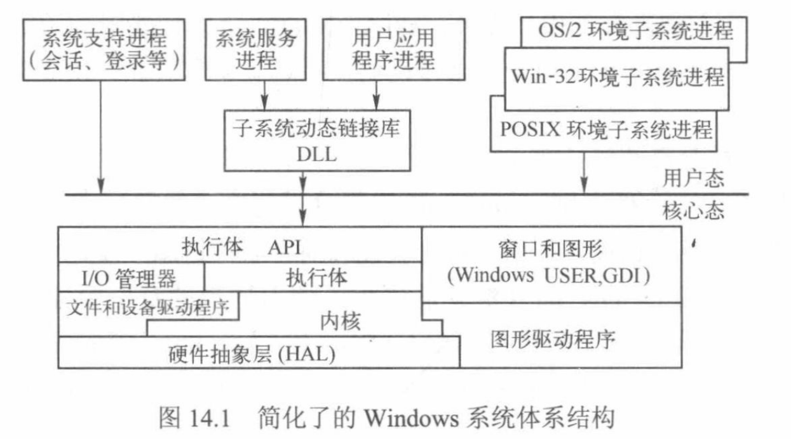

# 第14章 Windows2000/XP模型

1．Windows 采用什么样的体系结构？

  ```markdown
  > 体系结构见下图，考更多的时下面这段话
  - 从图中可以看出，系统可以划分为两种状态
    - 核心态
    - 用户态
  - 粗线上方代表用户态进程
    - 下方是核心态的操作系统服务
  - 因此四种类型的用户态进程都由各自的私有地址空间
  ```

  

  ```markdown
  这里可以再了解一下windows的特点
  1. 核心态组件使用了面向对象的设计原则，但不是一个面向对象的操作系统。
  2. 代码完全可重入，并可以被抢先。
  3. 融合了**分层**模型和**客户/服务器**模型。客户进程和服务器进程通过执行体中提供的**消息传递**工具进行通信。
  ```


2．硬件抽象层HAL的作用是什么？

  ```markdown
  硬件抽象层作用
    - 直接操控硬件
    - `HAL.dll`是一个可加载的核心态模块
    - HAL隐藏各种与硬件有关的细节，使内核、设备驱动程序和执行体免受特殊硬件平台差异的影响。系统可移植性好。
  ```

3．Windows系统组件的基本机制包括：陷阱调度、执行体对象管理器、同步（自旋锁、内核调度程序对象）、本地过程调用LPC等。

  ```markdown
  基本机制
  1. **陷阱调度** 
    - 属于*内核*的功能
    - 包括中断、DPC、APC、异常、系统服务调度
  2. **执行体对象管理器**
  3. **同步**
    - 自旋锁
    - 内核调度程序对象
  4. **本地过程调用LPC**
    - 服务器进程创建一个LPC连接端口对象
    - 然后再该端口上监听客户连接请求
    - 类似socket编程
    - 消息传递
  ```

4．理解：延迟过程调用DPC，异步过程调用APC

  ```markdown
  > 有点难理解可以看课本P272~P274
  1. 延迟过程调用DPC
    - DPC被用来执行一些相对于当前高优先级的任务来说不那么紧急的任务
    - 有时内核在进行系统嵌套调用时，检测到应该进行重调度
      - 为了保证调度的正确性，内核用DPC来延迟请求调度的产生
    - 硬件中断服务例程可以把一些相对不紧急的事情放到一个DPC对象中处理，从而缩短处理机停留在高IRQL的时间
    - **DPC队列**
      - 是一种机制
      - 能记住有哪些工作尚未处理
      - 是系统范围的
      - 当中断请求级别IRQL降低到DPC/Dispatcher级别以下时，DPC中断就产生。调度程序依次执行DPC队列中的每个例程，直至DPC队列为空。
  2. 异步过程调用APC
    - 为用户程序和系统代码提供了一种在特定*用户线程环境*中执行代码的方法
    - 每个线程都有自己的APC队列。APC队列也有内核管理。
    - 如果需要从内核空间复制一个缓冲去到*用户进程地址空间*，那么复制过程需要在用户进程上下文进行，这样*页表*才能包含内核缓冲区和用户缓冲区。
  ```

5．Windows中有哪些对象，都有什么作用？

  ```markdown
  1. 两种类型对象：执行体对象和内核对象。
  2. **执行体组件**：
    - 进程和线程管理器
    - 内存管理器
    - I/O管理器
    - 对象管理器等
  3. **内核对象**
    - 是由内核实现的一个初级对象集，
    - 对用户态代码不可见，
    - 仅供执行体使用。
    - 一个执行体对象可以包含一个或多个內核对象。
  ```


6．在多处理机系统中，提供了哪些同步和互斥机制？

  ```markdown
  1. 内核同步
    1. 互斥访问内核的临界区
    2. 内核引入**自旋锁**实现多处理机互斥机制。
    3. 在Intel处理机上，自旋锁时使用一条硬件支持的“测试与设置”指令来实现的
  2. 执行体同步
    1. 内核以内核对象的形式给执行体提供其他的同步机构—**调度程序对象**，包括：进程对象、线程对象、事件对象、信号量对象、互斥体对象、可等待的定时器对象及文件对象等。
    2. 每个同步对象都有“有信号”或“无信号”两种状态。线程可以等待一个或多个同步对象变为有信号状态，实现同步。
  ```


7．线程如何实现等待一个同步对象的操作？

  ```markdown
  对象管理器提供了两个系统服务程序，使线程与调度程序对象同步：
  - `WaitForSingleObeject()`
  - `WaitForMultipleObejects()`
  ```