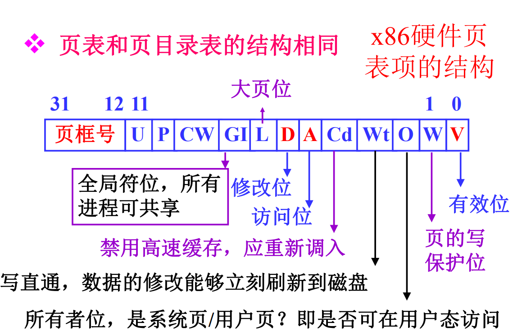
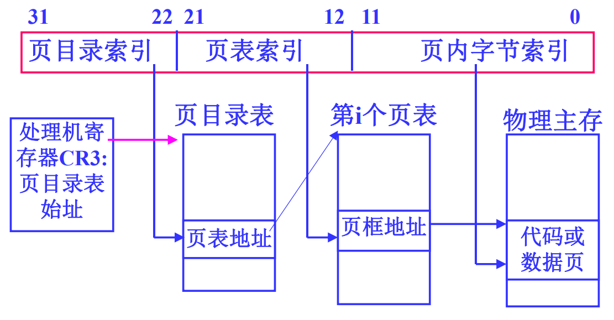
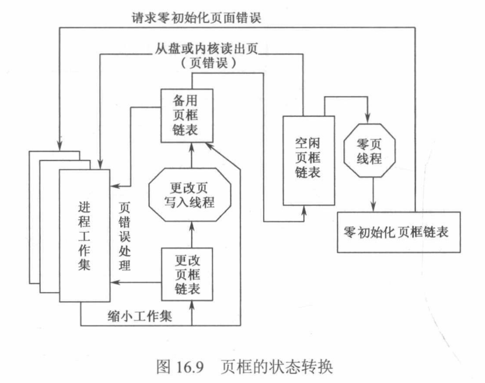

# 第16章 Windows存储器管理


## 复习提纲


1. 两种数据结构：虚拟地址描述符VAD、区域对象，这两种结构各有什么作用？ *考过*

    ```markdown
    1. 虚拟地址描述符VAD
        - 当线程要求分配一块连续虚存时，系统并不立即为其构造**页表**，而是为它建立一个VAD结构
        - **VAD结构**
            - 被分配的地址域
            - 该域是共享的还是私有的
            - 该域的存取保护以及是否可继承等信息
        - 进程页表的构建一直推迟到访问页才建立 *懒惰方式*
    2. 区域对象
        - 被称为**文件映射对象**
        - 是一个可被多个进程共享的存储区
        - 一个区域对象可被多个进程打开
        - 利用区域对象映射磁盘上的文件 *包括页文件*
        - 然后访问这个文件就像访问主存中的一个大数组
        - 而不需要使用文件的读/写操作
        - 作用
            1. 利用区域对象将一个可执行文件装入主存
            2. 可将一个大于进程地址空间的文件映射到进程地址空间中
            3. 缓存管理器利用区域对象访问一个被缓存文件中的数据
            - 具体描述其中第二点的过程：
                ① 创建或打开一个被映射的磁盘文件
                ② 创建一个与被映射文件大小相等的区域对象
                ③ 将区域对象的一个视口映射到进程保留的某部分地址空间，之后进程就可以像访问主存一样访问文件。当进程访问一个无效的页时，引起缺页中断，存储器管理器会自动地将这个页从映射文件调入主存。
                ④ 访问完成，解除被映射的这个视口，并将修改部分写回文件。
                ⑤ 若还需要访问文件的其他部分，可再映射文件的另一个视口，否则关闭区域对象和磁盘文件，结束映射过程。 
    ```

2. 虚拟内存区域：空闲的、保留的、提交的

    ```markdown
    虚存的分配
    
    1. 进程私有的2G地址空间的页可能是空闲的，或被保留，或被提交。
        - 被保留：已预留虚存，还没分配物理主存
        - 被提交：已分配物理主存或交换区
    2. 分配主存时，可以先保留地址空间，后提交物理主存；也允许保留和提交同时实现；
    3. 第一阶段只保留地址空间，特别适合线程正在创建大的动态数据结构的情况。
    ```


3. 32位逻辑地址，二级页表。页目录表项和页表项具有相同的数据结构，该数据结构包含哪些数据项？进程页表建立的时机。进程的地址转换过程。

    ```markdown
    - 32位的虚地址被分解为：
        - 页目录索引<10位>+页表索引<10位>+页内字节索引<12位>
    - 页目录表的每一项记录一个页表的地址。进程页表不再占用连续的主存空间。
        - 该数据结构包含哪些数据项可以看下图
    - 进程页表建立的时机
        - 进程页表的构建一直推迟到访问页才建立
    - 进程的地址转换过程见下下图

    ```

    

    

4. 管理物理内存的数据结构：页框数据库。页框的8种状态：活动、转换、备用、更改、更改不写入、空闲、零初始化、坏，页框的状态转换图16.9。

    ```markdown
    主存中的页框状态
    1. 活动 *有效*
        - 是进程工作集的一部分
    2. 转移
        - 说明一个页框正处于I/O操作进行中
    3. 备用
        - 已不属于工作集，页表项仍然指向该页，但被标记位正在转移的无效原型页表项PTE
    4. 更改
        - 已不属于工作集，修改未写磁盘，页表项仍然指向该页，但被标记位正在转移的无效PTE
    5. 更改不写入
        - 更改但不写入磁盘
    6. 空闲
        - 不属于任何一个工作集
    7. 零初始化
        - 清零的空闲页框
    8. 坏页框
    ```

    

5. 原型页表项，区域对象的页表。虚拟页式中，采用原型页表实现多进程共享页。 *考过*

    ```markdown
    - 原型页表项 *Prototype PTE*
    - 当一个页框被两个或者多个进程共享时，存储器管理器依靠一个原型页表项来记录这些被共享的页框
    - 当一个*区域对象*被创建时，这些原型页表项“按段”同时被创建
    - 当进程访问区域对象中的页时，再利用原型页表填写进程页表，进程页表才得以更新
    - 引入原型页表项是为了尽可能地减少对各进程的页表项的影响。
    ```

6. Windows采用的页替换策略是什么？

    ```markdown
    页调度策略
    1. 调页策略
        - 将所缺的页及其前后的一些页装入内存。
        - 试图减少调页I/O的次数
    2. 置页策略
        - 放到物理主存中
    3. 置换策略
        - 在多处理器系统中，采用了局部先进先出置换策略
        - 而在单处理器系统中，更接近于最近最久未使用策略 *LRU 时钟页面置换算法*
    ```