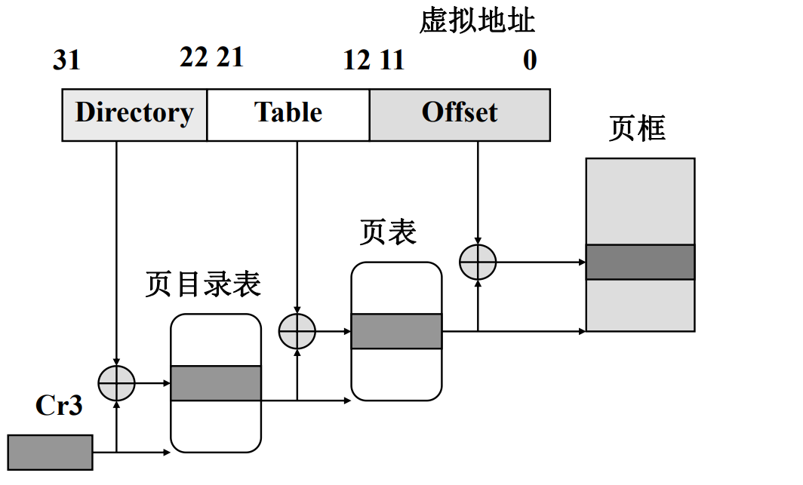

# 第8章 Linux存储器管理

## 易错点整理

- 管理进程虚拟内存的数据结构有
  - 单链表
  - 红黑树

## 复习提纲


1. 进程地址空间的划分？管理进程私有地址空间的数据结构？链接虚拟内存区域的**单链表**和**红黑树**。指向映射文件对象的指针字段？指向进程页目录表的指针字段？ *考过*

    ```markdown
    1. 进程地址空间的划分
        - 32位机，每个进程的地址空间为4GB
        - 进程的私有地址空间是前3GB
        - 后1GB是内核虚空间
            - 前896MB用来映射物理内存的前896MB
                - 因此前896MB的内存物理地址等于内核虚地址减去`0xC0000000`
            - 后128MB的虚空间实现对超过896MB的物理内存的映射
    ```

2. Linux堆的管理：malloc( )，free( )。

    ```markdown
    - malloc(size)
        - 请求size个字节的动态内存
    - free(ptr)
        - 释放ptr指向的动态内存
    ```


3. 管理物理内存页框的数据结构？内存管理区zone结构，伙伴系统？分区页框分配器分配页框的过程。 *考过*

    ```markdown
    1. 管理物理内存页框的数据结构
        - 页框描述符page
        - 所有的页框描述符存放在的数组mem_map
    2. 内存管理区zone结构
        - Linux把内存划分为3个管理区zone
        - `ZONE_DMA`
            - 包含低于16MB的常规内存页框。用于对老式的基于ISA设备的DMA支持 
        - `ZONE_NORMAL`
            - 包含高于16MB且低于896MB的常规内存页框
        - `ZONE_HIGHMEM`
            - 包含从896MB开始的高端物理页框。内核不能直接访问这部分页框。在64位体系结构上，该区总是空的
    3. 伙伴系统
        - 采用伙伴系统*buddy system*管理连续的空闲内存页框
        - 伙伴算法把空闲页框组织成11个链表，分别链有大小为1，2，4，8，16，32，64，128，256，512和1024个连续页框的块。
        - 解决外部碎片问题
        - 伙伴系统以页框为单位，适合对大块内存的分配请求
        - 解释分配页框的过程
        	- 假设要请求一个具有8个连续页框的块，
        	- 该算法先在8个连续页框块的链表中检查是否有一个空闲块。
        	- 如果没有，就在16个连续页框块的链表中找。
                - 如果找到，就把这16个连续页框分成两等份，
                    - 一份用来满足请求，
                    - 另一份插入到具有8个连续页框块的链表中。
        	- 如果在16个连续页框块的链表中没有找到空闲块，就在更大的块链表中查找。直到找到为止。
    
    
    ```

4. 理解slab分配器的原理。slab分配器的作用？

    ```markdown
    - slab分配器原理
        - 从**分区页框分配器**获得几组连续空闲页框
        - 为不同类型的对象生成不同的高速缓存，每个高速缓存存储相同类型的对象。高速缓存由一连串的slab构成，每个slab包含了若干个同类型的对象。
    - slab分配器作用
        - 为只有几十或几百个字节的小内存分配内存。如file对象。
    ```


5. 进程页表建立的时机？了解页目录表项或页表项所包含的字段。逻辑地址的划分，利用两级页表实现地址转换的过程。

    ```markdown
    1. 进程页表建立的时机 
        - 处理机普遍采用二级页表
        - 为每个进程分配一个页目录表
        - 页表一直推迟到访问页时才建立，以节省内存
    2. 页目录表项或页表项所包含的字段
        - Linux系统的页目录项和页表项的数据结构相同
    3. 逻辑地址的划分
        - 页目录索引<前10位>+页表索引<中间10位>+页内偏移<后12位>
    4. 利用两级页表实现地址转换的过程见下图
    ```

    


6. 请求调页。所缺的页可能存放的地方。 

    ```markdown
    1. 请求调页
        - 增加了系统中的空闲页框数
        - 页面置换策略是LFU（Least Frequently Used）
            - LRU关键是看页面最后一次被使用到发生调度的*时间长短*；而LFU关键是看一定时间段内页面被使用的*频率*
    2. 所缺的页可能存放的地方
        - 该页从未被进程访问过，且没有相应的内存映射
        - 该页已被进程访问过，但其内容被临时保存到磁盘交换区上
        - 在非活动页框链表上
        - 正在由其它进程进行I/O传输过程中
    ```

7. 了解盘交换区空间的管理方法。

    ```markdown
    - 每个盘交换区都由一组4KB的页槽组成。
    - 盘交换区的第一个页槽用来存放该交换区的有关信息，有相应的描述符。
    - 存放在磁盘分区中的交换区只有一个子区，
        - 存放在普通文件中的交换区可能有多个子区，
        - 原因是磁盘上的文件不要求连续存放。
    - 内核尽力把换出的页存放在相邻的页槽中，
        - 减少访问交换区时磁盘的寻道时间
    ```