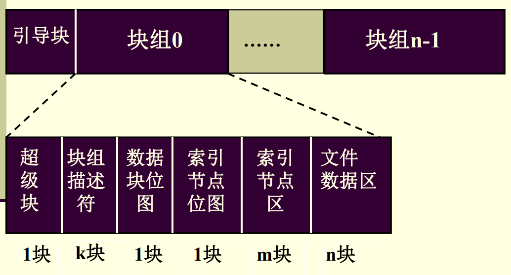
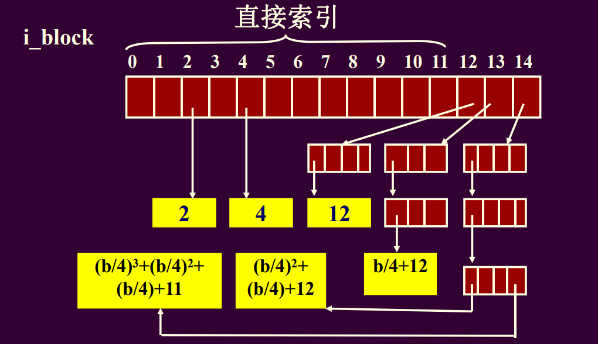
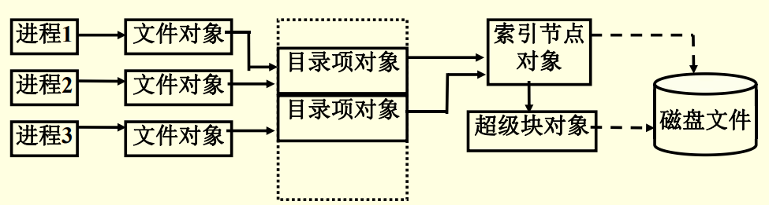
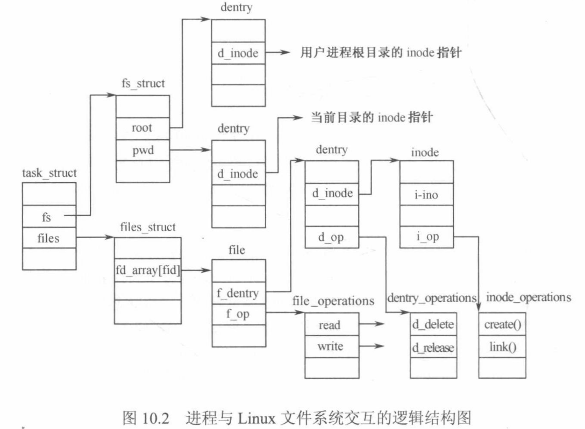

# 第9-10章 Linux文件系统

## 易错点整理

- Ext2文件系统采用存取控制表来保护文件
- 四个主要对象
  - 超级块对象
  - 目录项对象
  - 索引节点对象
  - 文件对象
- 块组不包含什么
  - 文件对象

```markdown
11. Linux系统支持的所有文件系统，在使用前必须完成两步操作。第一步，注册；第二步，需要用到（）进行记录。
    A. 注册表
    B. 索引表
    c. 安装表
    D. 目录表

我的理解：在A和C之间犹豫，但我们接触过的概念只有安装表，所以选C
```

## 复习提纲


1. Ext2文件卷的布局？各部分的作用是什么？ *块组*

    ```markdown
    1. Ext2文件卷的布局
        1. Ext2把磁盘块分为组，每组包含存放在相邻磁道的数据块和索引节点。块组的大小相等并顺序安排。
        2. Ext2用“块组描述符”来描述这些块组本身的结构信息，同时将超级块和所有块组描述符重复存储于每个块组中。
        3. Ext2通过“位图”来管理每个块组中的磁盘块和索引节点。盘块位图，索引节点位图。
    2. 各部分的作用：
        1. **超级块**存放整个文件卷的资源管理信息。
        2. **索引节点**存放文件的管理控制信息。
        3. 只有**块组0**中所包含的超级块和组描述符才由内核使用，而其余的超级块和组描述符保持不变，实时上，内核甚至不考虑他们。
        4. 盘块位图必须存放在一个单独的块中
        5. 索引节点也必须存放在一个单独块中
    ```

    

2. Linux系统把一般的文件目录项分成哪两部分？这样做的好处是什么？ *考过*

    ```markdown
    1. 把通常的文件目录项分成简单目录项和索引节点两部分
    2. 好处
        1. `简单目录项`包含了文件名和索引节点号等，可以*提高文件目录的检索速度*。
        2. 系统只保留一个索引节点，就可实现多条路径共享文件，*减少信息冗余*。
    ```

3. Linux文件系统的索引节点中，索引表划分成几级？文件的索引表是如何增长的？要求能够利用索引表实现将文件中的字节地址转换成文件的物理块的操作。

    ```markdown
    1. 索引表共十五个元素，划分为四级,
        - 每个元素占4B，假设块大小为bsize B
        - 12个直接索引项 0~11 
            - 大小为12 * bsize
        - 1个一次间接索引项 12
            - 逻辑块号 12 ~ 12 + bsize / 4 - 1
            - 大小为 (bsize / 4) * bsize
        - 1个二次间接索引项 13
            - 逻辑块号 12 + bsize / 4 ~ 12 + bsize / 4 + (bsize / 4)^2 - 1
            - 大小为 (bsize / 4)^2 * bsize
        - 1个三次间接索引项 14
            - 逻辑块号 12 + bsize / 4 + (bsize / 4)^2 ~ 12 + bsize / 4 + (bsize / 4)^2 + (bsize / 4)^3 - 1
            - 大小为 (bsize / 4)^3 * bsize
    ```

    

4. 硬链接和符号链接的区别？

    ```markdown
    > 可以查看[第五章问题8第二小问](./第5章.md)
    - 当符号链接文件的路径名小于60个字符时，就存放在`i_block[ ]`中；当大于60时，需要一个单独的数据块。可以跨文件系统。
    - 硬链接
        - 在共享目录项中简单地重复被共享文件的信息
        - 因此两个目录项的索引节点相同
    - 软链接（符号链接）
        - 创建一个新的目录项，其中存有指向另一个文件或目录的绝对路径名
    ```

5. Linux文件系统如何管理空闲存储空间？ 

    ```markdown
    - 磁盘块和索引节点的分配和回收
    - 文件的数据块和其索引节点尽量在同一个块组中。
    - 文件和它的目录项尽量在同一个块组中。
    - 父目录和子目录尽量在同一个块组中。
    - 每个文件的数据块尽量连续存放
    > 位示图
    ```

6. VFS通用文件模型中的四个主要对象？ *考过*

    ```markdown
    > 可能会问你为什么支持众多的文件卷
    - **超级块对象**
        - Linux为每个安装号的文件系统都建立一个超级块对象
    - **索引节点对象**
        - 代表一个文件，对应于存放在磁盘上的文件控制块
    - **目录项对象**
        - 代表一个目录项，是一个文件路径的组成部分，存放目录项与对应文件进行链接的信息。
    - **文件对象**
        - 记录了进程与打开的文件之间的交互信息
    ```

    

7. Linux系统中，进程打开一个磁盘文件要涉及哪些数据结构？它们各有哪些关键字段？他们的作用是什么？参考图10.2

    ```markdown
    - 数据结构和关键字段看图说话
    - 各关键字段的作用为：
        - `task_struct` 的 `files` 
            - 记录进程打开的文件信息；
        - `files_struct` 的 `fd_array`[]
            - 记录某打开文件中的各文件对象；
            - 文件对象指针数组
        - `file` 的 `f_dentry` 
            - 记录某文件对象对应的目录项对象；
        - `dentry` 的 `d_inode` 
            - 指向具体文件的 `inode；
    ```

    

8. 一个文件在使用与不用时各占用系统哪些资源？ 

    ```markdown
    - 文件在使用时会占用主存资源
    - 在不使用时仅占用外存资源
    - 因为Linux的虚拟文件系统VFS会在主存建立一系列的数据结构便于主存使用文件
    ```

9. 安装表的作用是什么？

    ```markdown
    - 由于Linux的文件系统在使用之前必须
        - 注册
            - *获得VFS提供的调用文件系统方法的接口*
        - 安装
            - *将文件系统安装到根文件系统某个目录节点上*
        - 故需要使用安装表vfsmount结构保存各文件系统的安装点和对应文件系统的信息
    - 内核将安装点与被安装的文件系统信息保存在vfsmount结构中，形成一个链式安装表。
    ```